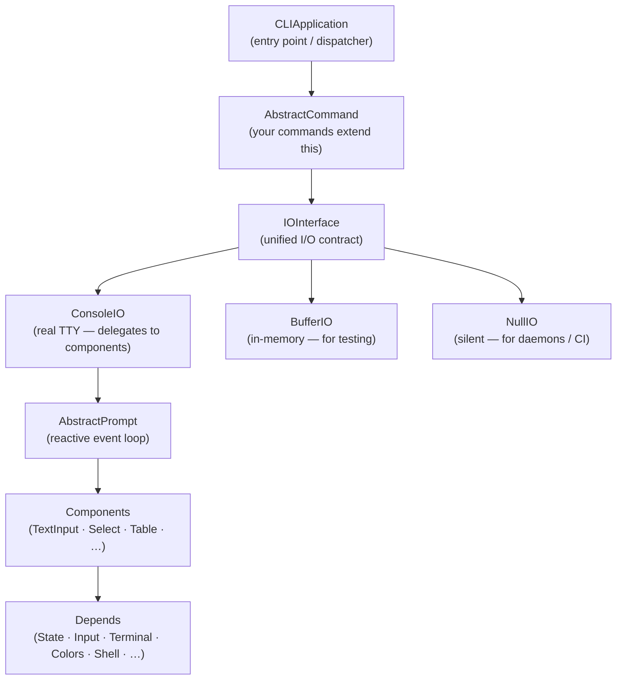
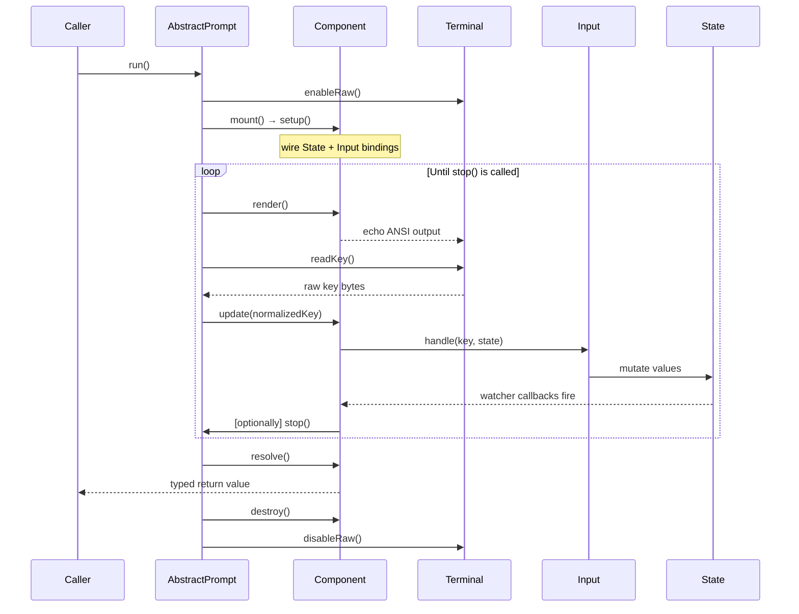
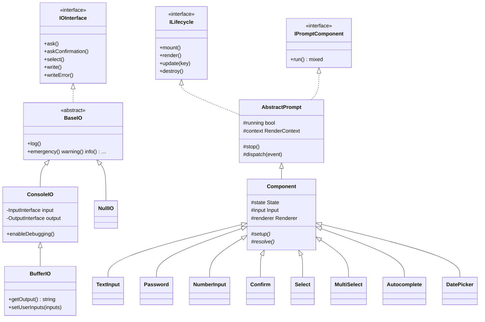
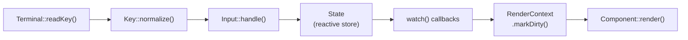
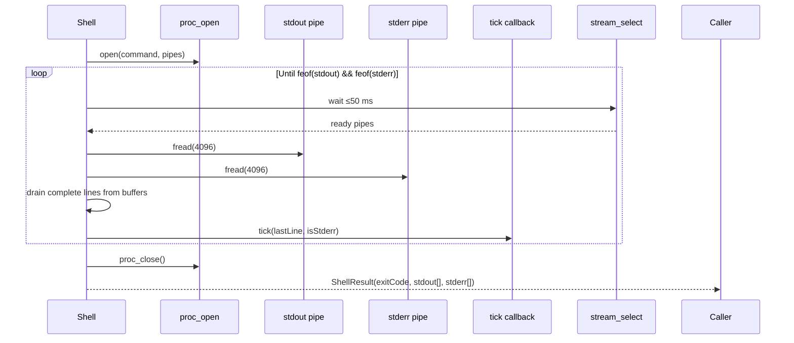
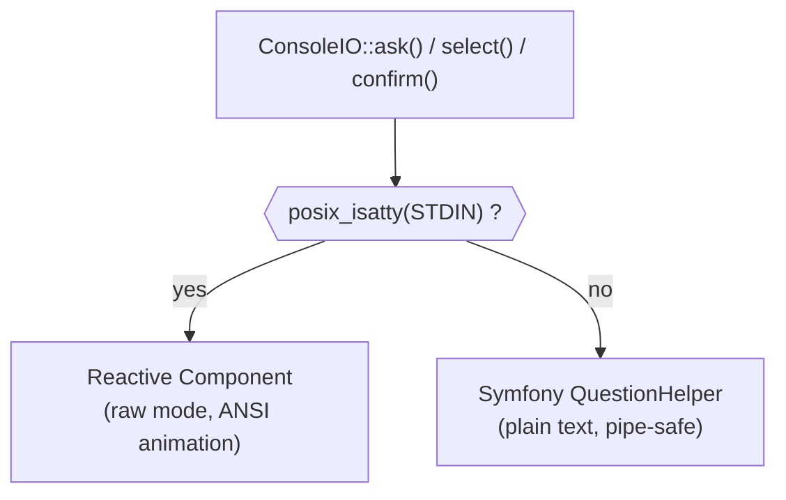

# Architecture

This document describes the internal structure of `php-io-cli` and how its layers relate to one another.

---

## High-level layer map



---

## Component lifecycle

Every interactive component (TextInput, Select, Confirm, …) extends `Component → AbstractPrompt` and runs through this lifecycle inside `run()`:



---

## Class diagram — core types



---

## Reactive state flow

`State` is the single source of truth for every component. Bindings in `Input` mutate it; `watch()` callbacks fire synchronously after each mutation and may trigger re-renders.



---

## Shell streaming model

`Shell::run()` avoids the classic pipe-deadlock problem by using `stream_select()` to drain stdout and stderr concurrently.



---

## IO fallback strategy

`ConsoleIO` detects the terminal type and delegates accordingly:



---

## Directory structure

```
src/
├── AbstractCommand.php      # Base for all commands
├── AbstractPrompt.php       # Reactive event loop engine
├── CLIApplication.php       # Dispatcher + built-in commands
├── Components/              # Interactive + display components
│   ├── Component.php        # Base: wires State, Input, Renderer
│   ├── TextInput.php
│   ├── Password.php
│   ├── NumberInput.php
│   ├── Confirm.php
│   ├── Select.php
│   ├── MultiSelect.php
│   ├── Autocomplete.php
│   ├── DatePicker.php
│   ├── Table.php
│   ├── Alert.php
│   ├── ProgressBar.php
│   └── SpinnerComponent.php
├── Depends/                 # Low-level primitives
│   ├── State.php            # Reactive key-value store
│   ├── Input.php            # Key binding dispatcher
│   ├── Terminal.php         # Raw mode, escape sequences
│   ├── Colors.php           # ANSI color / strip helper
│   ├── Renderer.php         # Scroll windowing, cursor mgmt
│   ├── RenderContext.php    # Per-frame metadata
│   ├── Shell.php            # proc_open streaming wrapper
│   ├── ShellResult.php      # Immutable result value object
│   ├── Fuzzy.php            # Fuzzy search + scoring
│   ├── Key.php              # Key constants + normalizer
│   ├── Spinner.php          # Frame-based spinner engine
│   └── SpinnerFrames.php    # Built-in frame sets
├── BaseIO.php               # PSR-3 bridge
├── ConsoleIO.php            # Real terminal IO
├── BufferIO.php             # In-memory IO (testing)
├── NullIO.php               # Silent IO (daemons)
├── Hooks.php                # Pub/sub event bus
├── IOInterface.php          # Unified I/O contract
├── ILifecycle.php           # Component lifecycle contract
├── IPromptComponent.php     # run() contract
├── IRenderer.php            # Renderer contract
└── Silencer.php             # PHP error suppression utility
```
